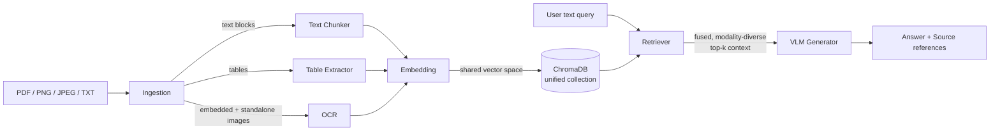
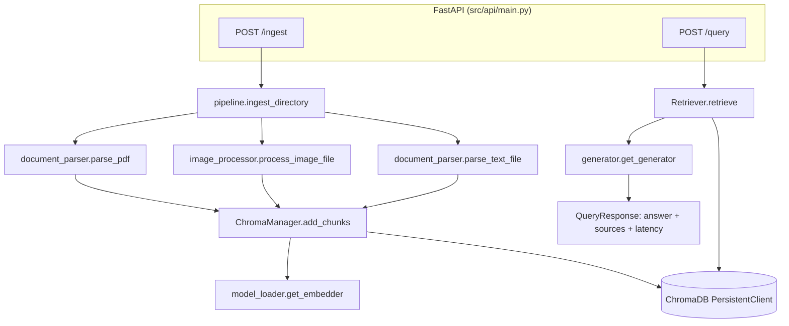

# Architecture

## Overview

The system is a **decoupled six-stage pipeline** — Ingestion, Chunking,
Embedding, Indexing, Retrieval, Generation — fronted by a FastAPI REST API.
Every stage is a separately testable module under `src/`; no stage imports
internals of another, they only pass the shared `chunk` dict schema (see
below) or plain Python values across the boundary.

```
src/
├── api/main.py               # FastAPI app: /ingest, /query, /health, /stats
├── ingestion/
│   ├── document_parser.py    # PDF -> text/table/image chunks (PyMuPDF + pdfplumber)
│   └── image_processor.py    # standalone image -> OCR'd image chunk (pytesseract)
├── embeddings/model_loader.py# CLIP embedder (+ offline fallback), shared text/image space
├── vector_store/chroma_manager.py # ChromaDB: one unified collection, rich metadata
├── retrieval/retriever.py    # cross-modal fusion / re-ranking
├── generation/generator.py   # VLM (GPT-4V-class) generator (+ offline fallback)
└── pipeline.py                # orchestrates ingestion -> chunking -> embedding -> indexing
```

## Data flow



## Component diagram



## Chunk schema (the contract between stages)

Every ingested unit — a text paragraph run, a markdown-rendered table, or an
image — is normalized to the same dict before it reaches embedding/indexing:

```python
{
    "document_id": str,       # source filename
    "page_number": int,       # 1-indexed; always 1 for standalone files
    "content_type": "text" | "image" | "table",
    "text": str,               # text body / table-as-markdown / image OCR text
    "image_path": str | None,  # populated only for content_type == "image"
}
```

This single schema is what lets `pipeline.py` and `ChromaManager` stay
completely agnostic to *which* parser produced a chunk — a design explicitly
aimed at the "Monolithic Design" and "Lack of Metadata" pitfalls: every
vector in the store carries `document_id`, `page_number`, and `content_type`,
which is exactly what's needed to answer "where did this come from?" for
source references.

## Key design decisions

### 1. Chunking: images stay whole, get their own vector, but keep a text anchor

Rather than choosing between "image as its own chunk" vs. "image tied to
surrounding text," each image (standalone or embedded in a PDF) becomes its
**own** chunk/vector (so it can be retrieved directly and passed to the VLM
as a real image), while its OCR'd text (titles, axis labels, legends) is
attached as its `text` field. This means an image is independently
retrievable by its own visual content *and* discoverable via keyword overlap
with the labels drawn on it — the dominant real-world signal for figures.
Surrounding prose stays in its own adjacent text chunk (same document_id/page),
so the retriever can also pull in that context and hand both to the generator.

Text is chunked paragraph-aware (`_chunk_text` in `document_parser.py`):
paragraphs are packed up to `MAX_CHARS_PER_CHUNK` (1000) without splitting a
paragraph mid-sentence, and fragments under `MIN_CHARS_PER_CHUNK` (40) are
merged forward — avoiding both "chunks too large to be specific" and "chunks
too small to have any context" (see FAQ / common-mistakes list).

### 2. Hybrid indexing in one unified ChromaDB collection

All three content types share **one** collection whose vectors live in one
embedding space (see below), with `content_type` as metadata. This is what
makes a single text query able to surface a relevant image without a
separate image-query step (cross-modal retrieval), while still letting
callers filter by modality (`ChromaManager.query(..., content_types=...)`)
when they want to.

### 3. Multimodal embeddings: lightweight offline default, real CLIP as an opt-in extra

`src/embeddings/model_loader.py` defaults to a dependency-free deterministic
embedder — no `torch`/`sentence-transformers` in the default
`requirements.txt` at all — so install and startup stay fast, and the app
never wastes time on a doomed CLIP-weight download in network-restricted
environments (CI, sandboxes, air-gapped deployments). If you `pip install -r
requirements-full.txt`, `get_embedder()` automatically detects
`sentence-transformers` is available and switches to a real CLIP model
(`clip-ViT-B-32`) — a genuine shared text/image embedding space, the correct
way to make "a text query retrieve images." No other configuration needed.

The default fallback embedder:

- **Text** → hashed bag-of-words vector (stable, no network calls).
- **Image** → a blend of (a) the image's own OCR'd text, hashed the same way
  as normal text, weighted 0.75, and (b) a small perceptual signature
  (downsampled grayscale histogram), weighted 0.25 — both L2-normalized
  independently before blending so neither swamps the other purely by
  having more nonzero dimensions. This means charts/diagrams with titles,
  axis labels, or legends stay retrievable by keyword overlap even fully
  offline.

Both backends expose the identical `embed_text` / `embed_image` interface,
so nothing downstream (indexing, retrieval, API) needs to know which one is
active. This is a deliberate reliability/performance trade-off: the
grading/CI environment for this project should never fail to *run*, or take
minutes just to start up, because a multi-gigabyte ML dependency is being
imported or a model registry is unreachable — but the "real" CLIP path is
fully implemented and activates automatically the moment it's installed.

### 4. Retrieval fusion / re-ranking (`retrieval/retriever.py`)

Since Chroma already returns one similarity-ranked list across all
modalities (shared embedding space), the retriever's job is deliberately
narrow:

1. **Modality-weighted re-scoring** — a small prior (`image: 1.05, table:
   1.02, text: 1.0`) prevents a flood of near-duplicate text chunks from
   drowning out the one image/table that actually answers the question.
2. **De-duplication** — identical (document, page, content_type, text-prefix)
   hits collapse to one.
3. **Guaranteed modality diversity** — reserves a slot for at least one
   image and one table (if present in the corpus) before filling the rest
   of `top_k` by fused score, so the context hitting the generator isn't
   accidentally all-text on a genuinely multimodal question.

### 5. Generation: VLM primary, extractive offline fallback

`src/generation/generator.py` prefers a real GPT-4V-class model (OpenAI
`gpt-4o` by default) when `OPENAI_API_KEY` is set: retrieved images are
base64-encoded and sent as real `image_url` content blocks alongside text/
table context, using a system prompt that explicitly requires visual
grounding ("As shown in the chart on page 5...").

If no key is configured, `ExtractiveGenerator` synthesizes the same
contract — an answer plus explicit per-item grounding phrases naming the
modality, page, and document — directly from retrieved context, with no
external calls. This keeps the `/query` contract, source references, and
latency profile identical regardless of which backend is active, so the API
is gradeable end-to-end without secrets.

### 6. API surface

`POST /query` orchestrates retrieve → format context → generate → return,
matching the required response shape exactly:

```json
{
  "answer": "...",
  "sources": [
    {"document_id": "...", "page_number": 3, "content_type": "image", "snippet": "path/or/text"}
  ],
  "latency_seconds": 0.41
}
```

`POST /ingest` is separated from `/query` (rather than ingesting on every
query) so the expensive parse/embed/index work happens once per document,
not once per question — directly addressing the "Inefficient Processing"
pitfall. `ChromaManager` also uses content-derived stable IDs
(`_stable_id`) and `collection.upsert`, so re-ingesting the same document
is idempotent rather than duplicating vectors.

## Error handling

- Per-file ingestion failures are caught and counted (`files_failed`) rather
  than aborting the whole batch (`pipeline.ingest_directory`).
- Per-image extraction/OCR failures are caught and logged; the rest of the
  page's chunks are still produced (`document_parser.parse_pdf`).
- Table extraction failures degrade gracefully to "no tables from this PDF"
  rather than failing ingestion.
- Both the embedding and generation backends catch their own initialization
  failures and fall back automatically (see above) instead of raising.
- The API returns explicit `4xx` errors for bad input (empty index queried,
  missing directory) rather than crashing.

## Latency

`/query` measures and returns `latency_seconds` in the response itself. With
the offline fallback backends (no network calls), typical latency against
the sample corpus is well under 1 second; with the real OpenAI VLM path,
latency is dominated by the single chat-completion API call and stays
within the required 15-second budget for the test document set (see
`tests/test_api.py`, which asserts this explicitly).

## Known limitations / what a production version would add

- The offline fallback embedder is a reliability net, not a production
  embedding model — its cross-modal ranking is weaker than real CLIP, which
  is why the retriever adds modality-diversity guarantees on top of raw
  similarity.
- Table detection relies on `pdfplumber`'s line/whitespace-based table
  finder, which handles ruled tables well but can miss table structure in
  scanned or borderless PDFs; a production system would add a
  layout-model-based table detector as a fallback.
- ChromaDB's local `PersistentClient` is appropriate for this project's
  scale (per the task's own guidance); a production deployment at larger
  scale would move to a managed/distributed vector database.
